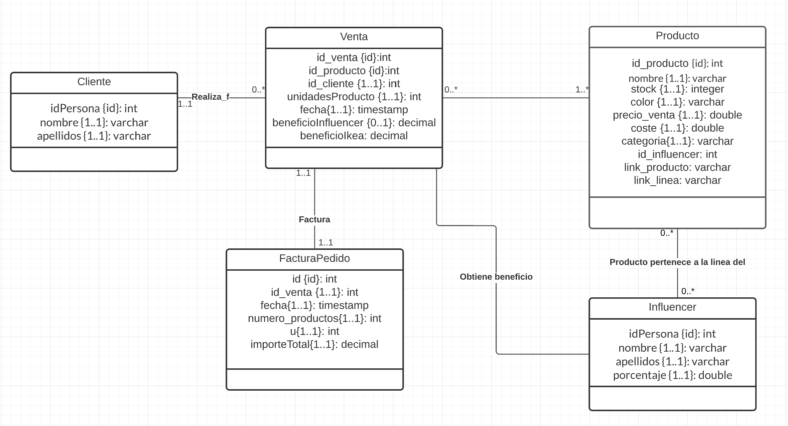

# Data-Project-1

## Primer data project del máster en Data Analytics

Equipo:
  - Claudia Darás de la Fuente
  - Rafael Cuquerella Cots
  - Javier Riaza Gallart
  - Alejandro Palanca Albert
  - Julio Sahuquillo Huerta 

- **Cliente** : IKEA

- **Caso de estudio** : Nueva línea de negocio basada en la monetización de las ventas de los productos generadas por una serie de influencers en España.

- **Objetivo**: Generar un programa que permita analizar y proyectar la viabilidad del caso.

- **Supuestos**:

  1. Los influencers generan ventas a la compañía y a cambio recibirán una reward o monetización a cambio por producto vendido (en un % asignado).

  2. Comparativa de las ventas de Ikea antes de tener las lienas con los influencers, y después de trabajar con ellos.

## Justificación de las herramientas utilizadas:

- **Ingestión, tratamiento y carga de datos (ETL)**

Para poder hacer el proceso de ETL hemos hecho uso del lenguaje Python, el cual es un lenguaje interpretado de fácil uso y comprensión para los técnicos de la compañía.

1. Por un lado, los datos de los influencers los hemos sacado de los diferentes contratos que se harían con ellos. Con el lenguaje de programación los obtenemos del csv, los tratamos y los cargamos en la base de datos.
2. Los datos relacionados con los productos los hemos sacado del propio catálogo de ikea, por lo que los leemos de un archivo csv, los tratamos y cargamos con ayuda del lenguaje python para poder tener toda la información en la base de datos.
3. Respecto a los clientes, en este proyecto se han generado de forma aleatoria, ya que la información de los clientes no tiene mayor interés en este proyecto. Se generan con python y se cargan en la misma base de datos.
4. Para los datos relacionados con las ventas, generadas de forma aleatoria. Una vez tenemos cargados en la base de datos la información de los 3 puntos anteriores, mediante consultas a la base de datos vamos generando dichas ventas. De esta forma, todo guarda sentido y unión.
5. A la vez que se van generando las ventas generamos las facturas de los pedidos por cliente, para así tener un resumen completo de la venta, ya que, esta puede tener más de un producto por cliente.

- **Almacenamiento de datos**
  

Para el almacenamiento de datos hemos decidido utilizar una base de datos de tipo relacional, más concretamente PostgreSQL. Para una mejor visualización de la base de datos hemos también utilizado la herramienta pgAdmin, la cual es una interfaz gráfica que soporta todas las características de PostgreSQL. También facilita de gran manera la administración, ya que,  nos permite desde hacer búsquedas SQL, hasta desarrollar toda nuestra base de datos de forma muy fácil e intuitiva: directamente desde la interfaz gráfica.

Mediante la conexión al puerto `localhost` en el navegador se permite la visualización de todos estos datos en pgadmin. Nos pedirá una cuenta y contraseña:

- `Cuenta: "root@root.com"`

- `Correo: "root"`

Con el comando docker compose up se levanta el contenedor.

- **Contenerización**

Para esta parte hemos utilizado la herramienta Docker. El uso de esta herramienta se debe a que sus puntos más fuertes son la portabilidad, el aislamiento, la seguridad y el ahorro de tiempo, por lo que facilita mucho el desarrollo y testeo de aplicaciones.  

- **Visualización de los Datos**
  

Para la visualización de los datos generados hemos seleccionado la herramienta Tableau. Mediante una conexión a la base de datos de postgreSQL, se importan los datos a la herramienta Tableau, desde esta plataforma se permite llevar a cabo el uso de los datos y su transformación en gráficos aportando valor a la empresa, visualmente se puede observar la información de una forma clara, sencilla y sintetizada.

## Origen de los datos:

Utilizamos como dataset una muestra del top 5 influencers más influyentes de España.
Utilizamos como dataset una muestra de los 23 productos de IKEA más comprados para realizar nuestro estudio.
Generamos datos aleatorios de los clientes con el fin de simular las ventas de los productos que producen los influencers con el fin de poder ofrecer una respuesta al caso.

## Modelo de datos

Modelo de datos descriptivo - ya que se quiere cuantificar las relaciones en los datos. En la siguiente imagen se ve una muestra del modelo de datos de este proyecto. La base de datos esta construida en base a dichas entiendades, relaciones y atributos que ahí se ven.

